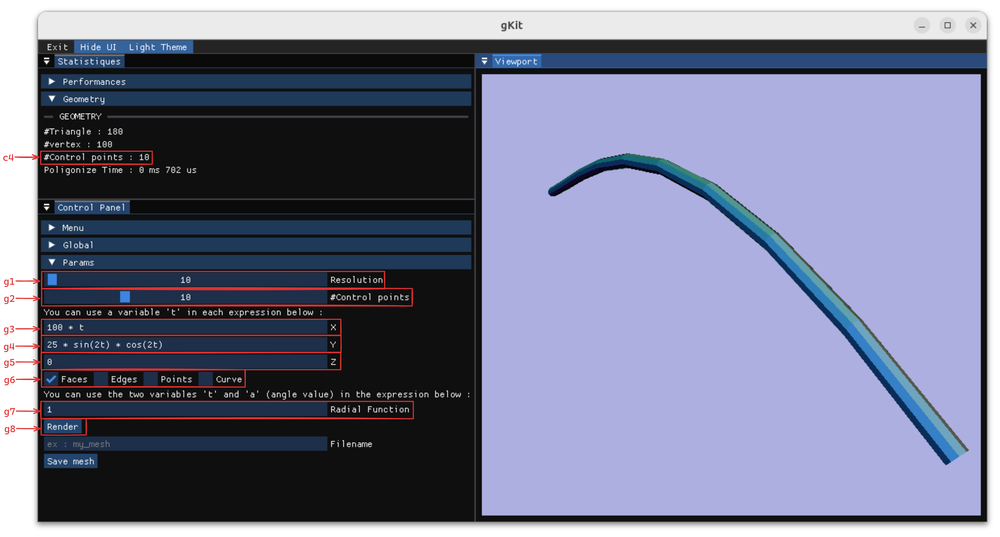

<a id="readme-top"></a>
<details>
  <summary>Sommaire</summary>
  <ol>
    <li>
      <a href="#about-the-project">À propos</a>
      <ul>
        <li><a href="#goals">Objectifs</a></li>
        <li><a href="#structure">Structure du projet</a></li>
        <li><a href="#libraries">Librairies utilisées</a></li>
      </ul>
    </li>
    <li>
      <a href="#getting-started">Compiler le projet</a>
      <ul>
        <li><a href="#prerequisites">Prérequis</a></li>
        <li><a href="#installation">Installation</a></li>
        <li><a href="#build">Build & exécution</a></li>
      </ul>
    </li>
    <li>
      <a href="#application">Application</a>
      <ul>
        <li><a href="#global-features">Fonctionnalités globale</a></li>
      </ul>
        <li><a href="#spline-demo">Démo courbe de Bézier</a></li>
        <li><a href="#patch-demo">Démo patche de Bézier</a></li>
        <li><a href="#sdf-demo">Démo surface implicite (SDF)</a></li>
      </ul>
    </li>
  </ol>
</details>

<p align="right">(<a href="#readme-top">back to top</a>)</p>

<a id="about-the-project"></a>

## À propos

Ce projet a été réalisé dans le cadre de l'unité d'enseignement "Modélisation Géométrique" en Master 2 ID3D à l'Université Claude Bernard Lyon 1, Villeurbanne.    

<p align="right">(<a href="#readme-top">back to top</a>)</p>

<a id="goals"></a>

### Objectifs

##### Génération de surfaces maillées 
-  Générer des surfaces maillées à partir d’un ensemble de points ou de courbes
de contrôle.

##### Surfaces de révolution et d’extrusion

- Générer des surfaces d’extrusion à partir d’une courbe génératrice.

##### Modélisation à l’aide de surfaces implicites

- L’objectif est de modéliser des SDF à l’aide d’un arbre de construction hiérarchique

<p align="right">(<a href="#readme-top">back to top</a>)</p>

<a id="structure"></a>

### Structure du projet 

```
  ├── data                  
  |   ├── obj                 # Les maillages sont sauvegardés ici. 
  |   └── shaders             # Shaders utilisés pour le rendu avec GKit.
  ├── src                   # Code 
  |   ├── Include             # Fichiers .h.  
  |   |   └── ...
  |   ├── Source              # Fichiers .cpp.  
  |   |   └── ...
  |   ├── CMakeLists.txt      # Fichier de configuration CMake. 
  |   └── main.cpp              
  ├── vendor 
  |   ├── exprtk # Exprtk lib
  |   ├── gkit   # Gkit lib
  |   └── imgui  # ImGUI lib
  ├── .gitignore            # Fichier .gitignore.
  ├── CMakeLists.txt        # Configuration Cmake.
  ├── imgui.ini             # Configuration ImGui.
  └── README.md             # Fichier README du projet.
```

<p align="right">(<a href="#readme-top">back to top</a>)</p>

<a id="libraries"></a>

### Librairies utilisées

Le projet est en C++. Les librairies utilisées sont listées ci-dessous : 

* [GKit](https://perso.univ-lyon1.fr/jean-claude.iehl/Public/educ/M1IMAGE/html/index.html) : Utilisé pour visualiser les maillages générés. 
* [ImGUI](https://github.com/ocornut/imgui) : Utilisé pour gérer l'UI de l'application.
* [exprtk - C++ Mathematical Expression Toolkit Library](https://github.com/ArashPartow/exprtk) : Utilisé pour parser une chaînes de caractères en une expression arithmétique.

Ces librairies sont accessibles dans le répertoire *vendor*. 

<p align="right">(<a href="#readme-top">back to top</a>)</p>

<a id="getting-started"></a>

## Compiler le projet

Ce projet ne compile que sous Linux. 

<p align="right">(<a href="#readme-top">back to top</a>)</p>

<a id="prerequisites"></a>

### Prérequis

GKit utilise SDL2 et Glew :  
```sh
sudo apt install libsdl2-dev libsdl2-image-dev libglew-dev
```

<p align="right">(<a href="#readme-top">back to top</a>)</p>

<a id="installation"></a>

### Installation

1. Cloner le dépôt 
```sh
git clone https://github.com/tgrillon/modgeo.git
```

<p align="right">(<a href="#readme-top">back to top</a>)</p>

<a id="build"></a>

### Build & exécution

1. Build le projet avec cmake : 
    ```sh
    cmake -B build -DCMAKE_BUILD_TYPE=Release && cmake --build build/ -t modgeo -j 12
    ```
2. Lancer l'application :
    ```sh
    ./build/modgeo 
    ```
<p align="right">(<a href="#readme-top">back to top</a>)</p>

<a id="application"></a>

## Application

L'application utilise ImGui qui permet d'avoir une interface modulable avec des fenêtres dockables : 


###### Trois fenêtres 
- La fenêtre de statistiques 
- Le panneau de contrôle où l'utilisateur peut accéder aux démos et a accès à différents paramètres.
- La fenêtre de rendu où le maillage est visualisé. 


<p align="right">(<a href="#readme-top">back to top</a>)</p>

<a id="global-features"></a>

### Fonctionnalités globales


- `a` : *Menu bar*
  - `1` : Quitter l'application.
  - `2` : Afficher/Masquer l'interface utilisateur.
  - `3` : Mode sombre/clair.
- `b` : *Performances*
  - `1` : Image par secondes.
  - `2` : Temps CPU.
  - `3` : Temps GPU.
  - `4` : Frame rate.
- `c` : *Geométrie*
  - `1` : Nombre de triangles.
  - `2` : Nombre de sommets.
  - `3` : Temps de polygonisation.
- `e` : *Paramètre de scène*
  - `1` : Taille de sommet.
  - `2` : Taille d'arête.
  - `3` : Couleur de fond, des sommets, des arêtes, etc...
- `f` : *Sauvegarde de maillage* 
  - `1` : Nom du fichier. 
  - `2` : Sauvegarder le maillage au format OBJ. Le fichier est sauvegardé dans le répertoire `data/obj`.

<p align="right">(<a href="#readme-top">back to top</a>)</p>

<a id="spline-demo"></a>

### Démo courbe de Bézier

Cette démo permet de jouer avec des courbe de Bézier. 



- `c` : *Géométrie*
  - `4` : Nombre de points de contrôle.
- `g` : *Paramètres*
  - `1` : Résolution du maillage.
  - `2` : Nombre de points de contrôle.
  - `3` : Fonction de génération de points sur l'axe X.
  - `4` : Fonction de génération de points sur l'axe Y.
  - `5` : Fonction de génération de points sur l'axe Z.
  - `6` : Afficher/Masquer les faces, les arêtes, les sommets et la courbe suivie par la spline.
  - `7` : Fonctrion radiale pour la surface de révolution.
  - `8` : Générer le maillage.

<p align="right">(<a href="#readme-top">back to top</a>)</p>

<a id="patch-demo"></a>

### Démo patche de Bézier

Cette démo permet de jouer avec des patches de Bézier.

 

- `g` : *Paramètres*
  - `1` : Afficher/Masquer la grille suivie par le patche.

<p align="right">(<a href="#readme-top">back to top</a>)</p>

<a id="sdf-demo"></a>

### Démo surface implicite (SDF)

Cette démo permet de jouer avec des surfaces implicites (SDF). 


- `h` : *Paramètres*
  - `1` : Construction de l'arbre.
    - `1.1` : Affiche la primitive ainsi que l'opérateur sélectionné pour la construction de l'arbre. 
    - `1.2` : Sélection d'une primitive à ajouter dans l'arbre de construction.   
    - `1.3` : Sélection d'un opérateur binaire (Union, Intersection, Différence, etc...).
    - `1.4` : Sélection d'un opérateur unaire (Coque, etc...).
    - `1.5` : Ajouter une transformation (Translation, Rotation, Homothétie, etc...).
  - `2` : Modification de l'arbre.
    - `2.1` : Modification des paramètres de la primitive.
    - `2.2` : ....
  - `3` : Paramètres de la boîte utilisée pour l'algorithme d'approximation du maillage de la surface implicite.
  - `4` : Afficher la boîte.
  - `5` : Générer/Supprimer le maillage correspondant à la surface implicite décrit par l'arbre.

<p align="right">(<a href="#readme-top">back to top</a>)</p>

### Exemple


<p align="right">(<a href="#readme-top">back to top</a>)</p>
